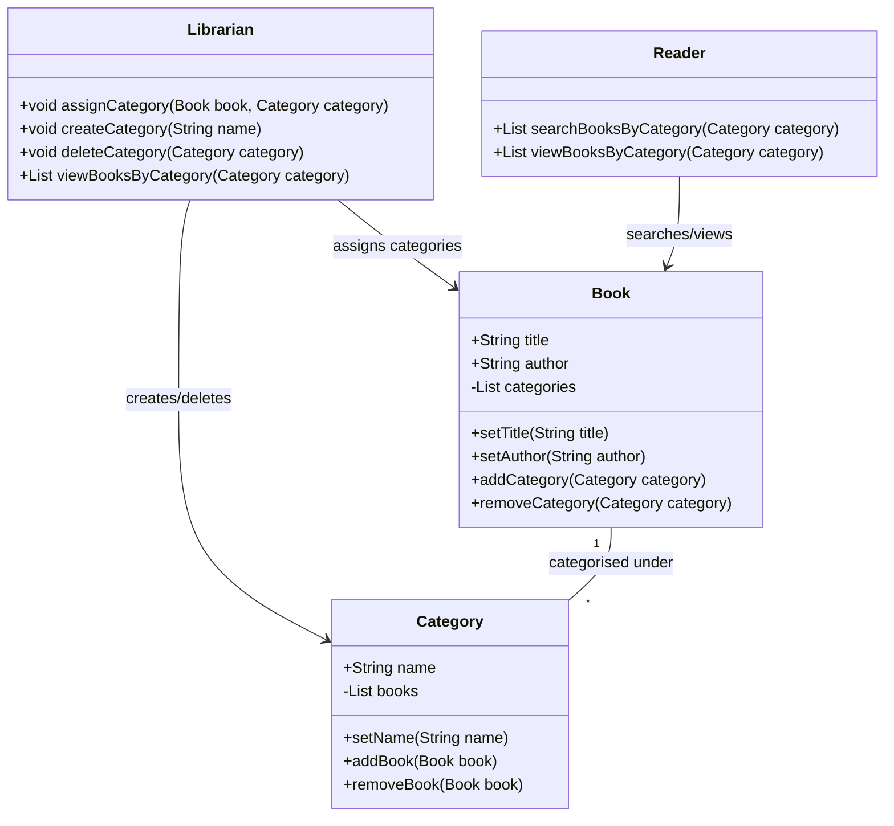
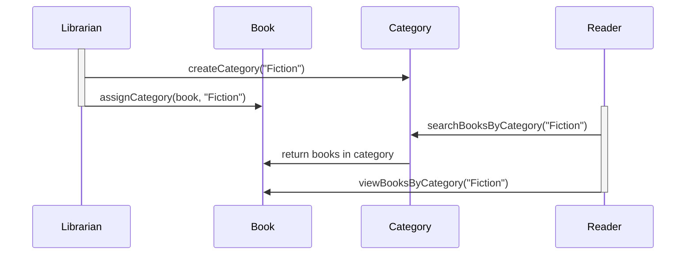
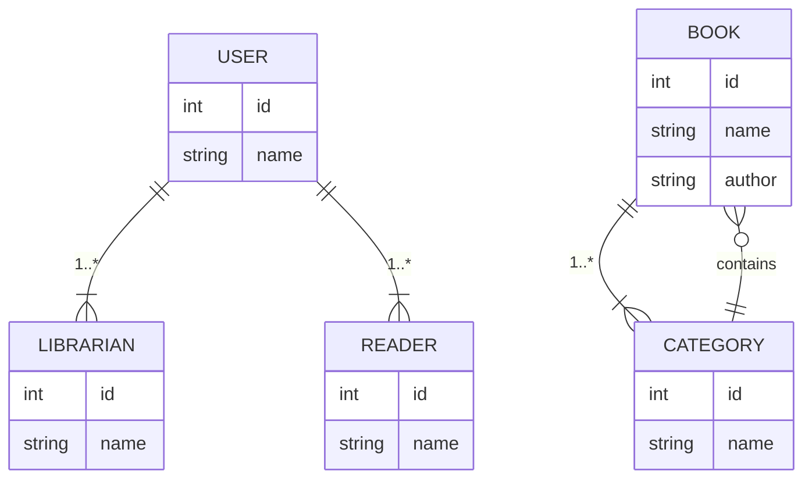

1. Class Diagram:

```mermaid
classDiagram
    class Book {
        +String title
        +String author
        -List<Category> categories
        +setTitle(String title)
        +setAuthor(String author)
        +addCategory(Category category)
        +removeCategory(Category category)
    }
    class Category {
        +String name
        -List<Book> books
        +setName(String name)
        +addBook(Book book)
        +removeBook(Book book)
    }
    class Librarian {
        +void assignCategory(Book book, Category category)
        +void createCategory(String name)
        +void deleteCategory(Category category)
        +List<Book> viewBooksByCategory(Category category)
    }
    class Reader {
        +List<Book> searchBooksByCategory(Category category)
        +List<Book> viewBooksByCategory(Category category)
    }
    Librarian --> Book : assigns categories
    Librarian --> Category : creates/deletes
    Book "1" -- "*" Category : categorised under
    Reader --> Book : searches/views
```
2. Sequence Diagram:

```mermaid
sequenceDiagram
    participant L as Librarian
    participant B as Book
    participant C as Category
    participant R as Reader
    activate L
    L ->> C: createCategory("Fiction")
    L ->> B: assignCategory(book, "Fiction")
    deactivate L
    activate R
    R ->> C: searchBooksByCategory("Fiction")
    C ->> B: return books in category
    R ->> B: viewBooksByCategory("Fiction")
    deactivate R
```

3. **ER Diagram**

```mermaid
erDiagram
    USER {
        int id
        string name
    }
    LIBRARIAN {
        int id
        string name
    }
    READER {
        int id
        string name
    }
    BOOK {
        int id
        string name
        string author
    }
    CATEGORY {
        int id
        string name
    }
    USER ||--|{ LIBRARIAN : "1..*"
    USER ||--|{ READER : "1..*"
    BOOK ||--|{ CATEGORY : "1..*"
    CATEGORY ||--o{ BOOK : contains
```